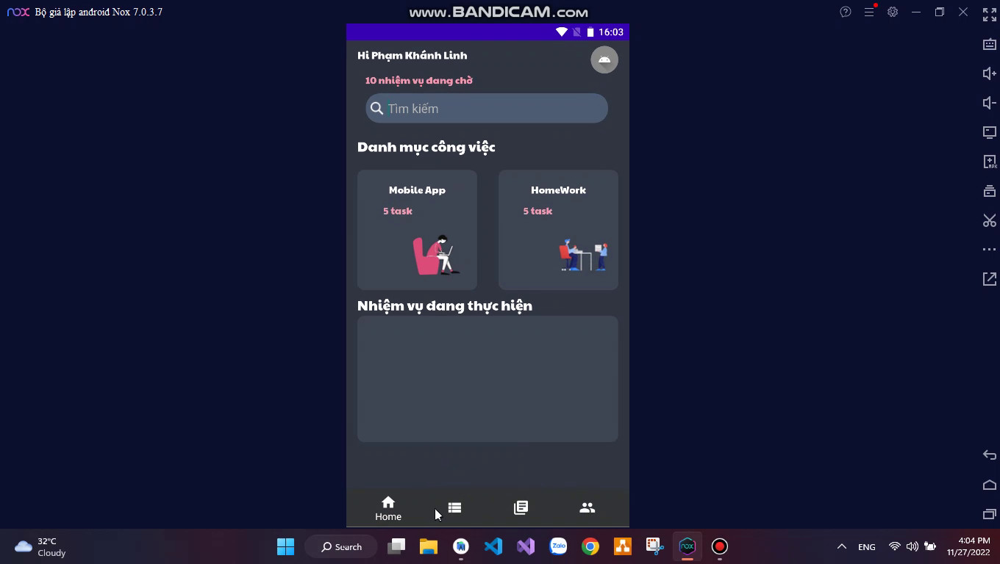
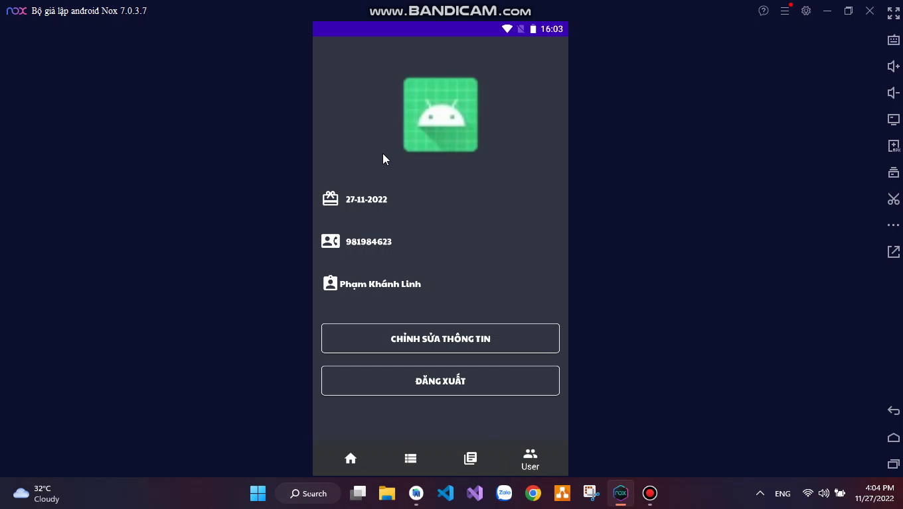
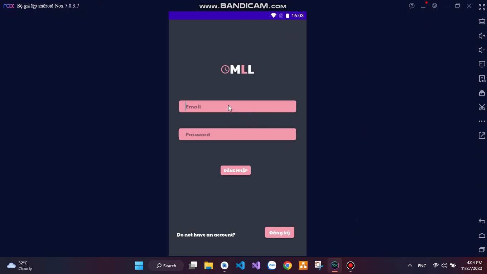
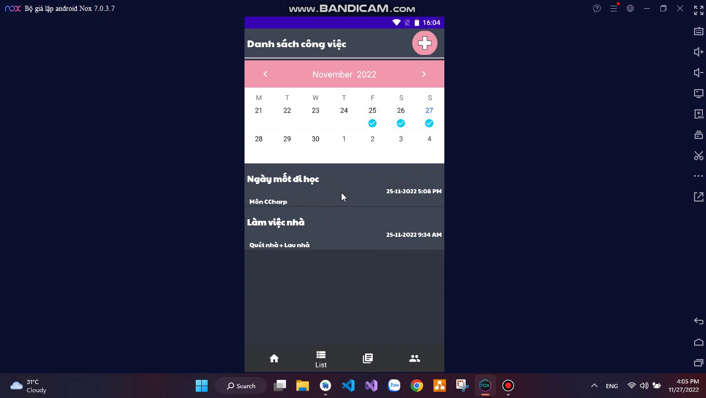
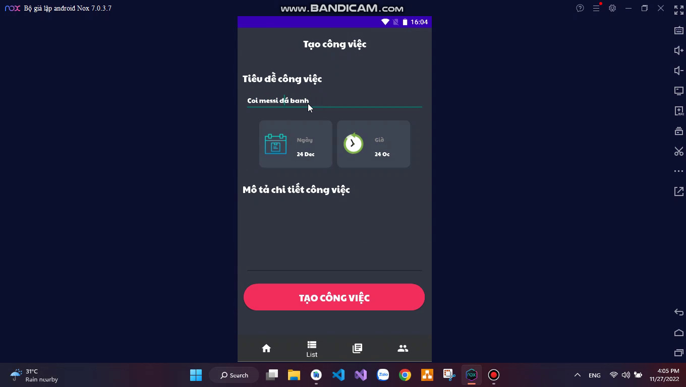
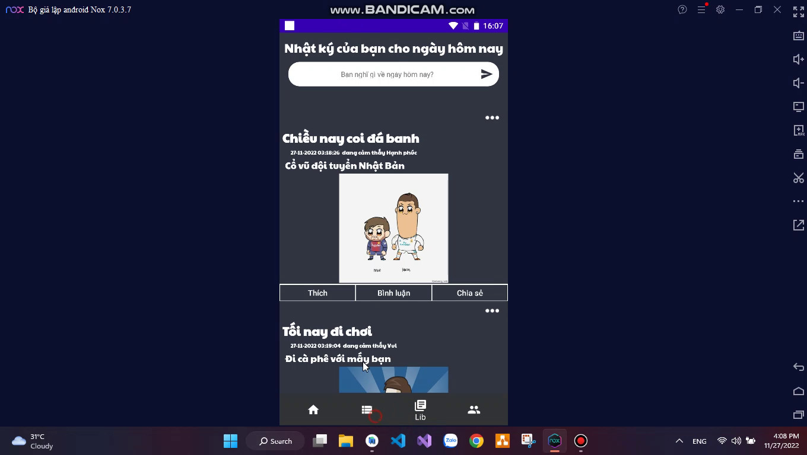
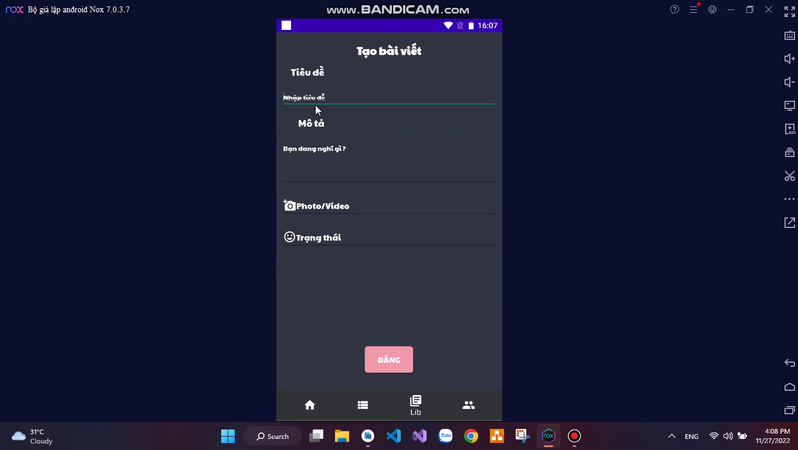
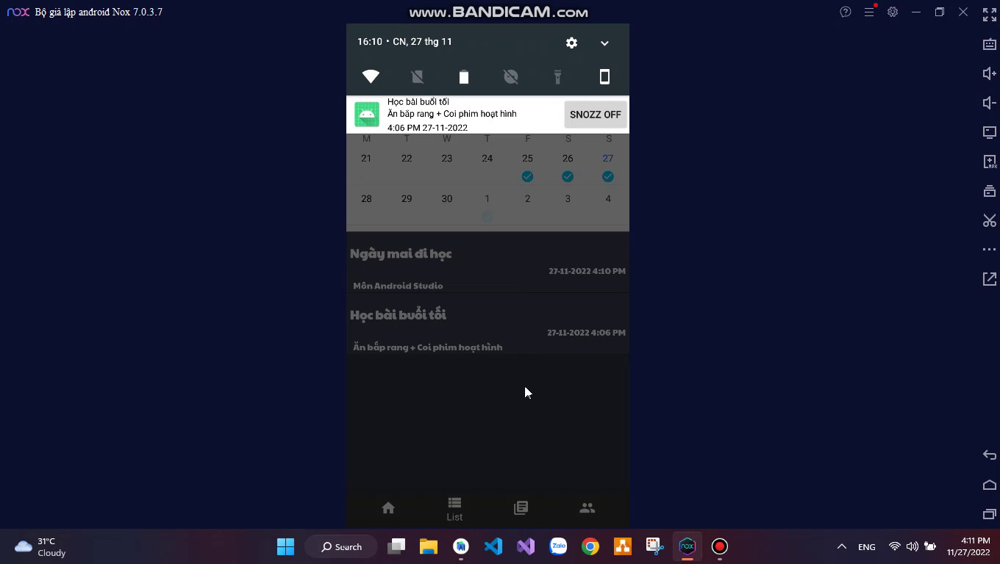

# Mobile application for task reminders and notes
## Team  Members:
```bash
Saigon University ,Faculty of Information Technology ,Major in Software Engineering
ID          | Full Name
3120410278    Nguyen Thanh Quynh Linh
```
## Project Description:
Planning is really necessary in everyone's life, it helps people have goals and record their personal feelings to know their strengths, weaknesses, achievements or what has not been done to be motivated. more effort. In the current technology era, TodoList or Dinary applications are many on the Store, but the two have not been combined.
With the above idea, I designed the To-Do List and Personal Diary application to help people set goals and work solutions for themselves and improve themselves.
## Tech Stack Used:
```bash
BackEnd:
    * Java + Framework Retrofit 2
Database:
    * MySql + PHP
```
## Features of the app:
Requested function:
```bash
*Login, register for users
*Add, edit, delete daily and daily tasks
*Managing tasks by day
*Post, edit, delete logs
*Showing user information
*Manage tasks and posts
```
User requirements:
```bash
*Add task by date: user will create task by date, and will display task list by date,
*Mark the job: the job is completed, then type in the CheckBox and calculate the number of completed, unfinished and total jobs
*Edit jobs and delete unnecessary jobs.
*Account management: Users create their own accounts, add necessary information and can change their own personal information.
*Login Register: users can post their thoughts, photos and feelings in their personal diary. Users can also edit and delete logs
*Task management: count the number of completed and uncompleted goals and the total number of goals by day
```
## Steps to run the application:
1. Clone from github to folder
2. Copy <a href="https://github.com/Quynh-Linh-IT/Mobile_application_for_task_reminders_and_notes.git"> PHP folder</a> from github and add to htdocs folder in xampp
3. Add mobile_db.sql in Database folder PHP to Mysql
4. Then launch the app
## [Project Demo Link](https://www.youtube.com/watch?v=sioYzsuVgwQ)
## Some features of the site:
Home Page                   |                   User Information Page
:---------------------------------:        |      :------------------------------:
  | 

Login Page                   |                   Job Listing Page
:---------------------------------:        |      :------------------------------:
  | 

New Job Creation Page                   |                   Diary List Page
:---------------------------------:        |      :------------------------------:
  | 

Post Creation Page                   |                   Notification
:---------------------------------:        |      :------------------------------:
  | 
### Make sure to star the repository if you find it helpful!
<a href="https://github.com/Quynh-Linh-IT/Mobile_application_for_task_reminders_and_notes/stargazers"></a>